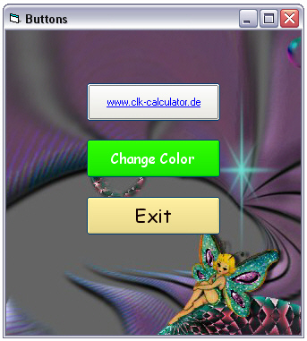



## XP Style Button 2

### Description

This is the 2nd version of the XP Style Button. Have a look at the Screenshot. What you see is what you get. It even brings the look and feel of XP to 9x.

The color of the gravel surface can be selected from properties or during runtime.

You can select a MouseOver color, a MouseOverFrame color or hide one of them if you select the same color.

The edges are round on any background.

Please send me your feedback for improvements
 
### More Info
 

             |
---                |---
**Submitted On**   |2004-12-27 10:36:18
**By**             |[L\. Kobarg](https://github.com/Planet-Source-Code/PSCIndex/blob/master/ByAuthor/l-kobarg.md)
**Level**          |Advanced
**User Rating**    |5.0 (10 globes from 2 users)
**Compatibility**  |VB 6\.0
**Category**       |[Custom Controls/ Forms/  Menus](https://github.com/Planet-Source-Code/PSCIndex/blob/master/ByCategory/custom-controls-forms-menus__1-4.md)
**World**          |[Visual Basic](https://github.com/Planet-Source-Code/PSCIndex/blob/master/ByWorld/visual-basic.md)
**Archive File**   |[XP\_Style\_B18343012292004\.zip](https://github.com/Planet-Source-Code/l-kobarg-xp-style-button-2__1-57972/archive/master.zip)

### API Declarations

quite a few

